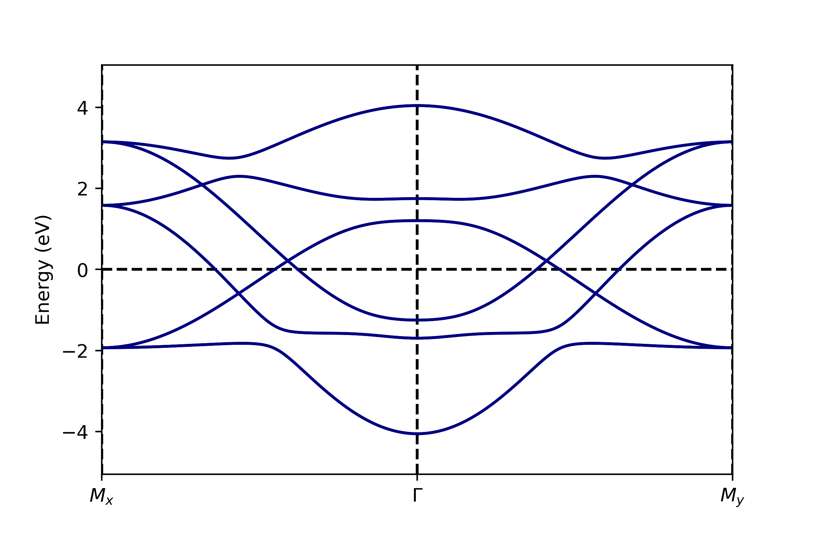
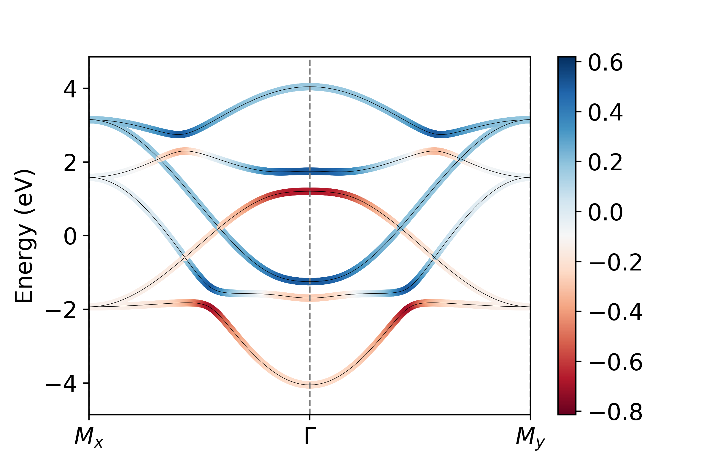
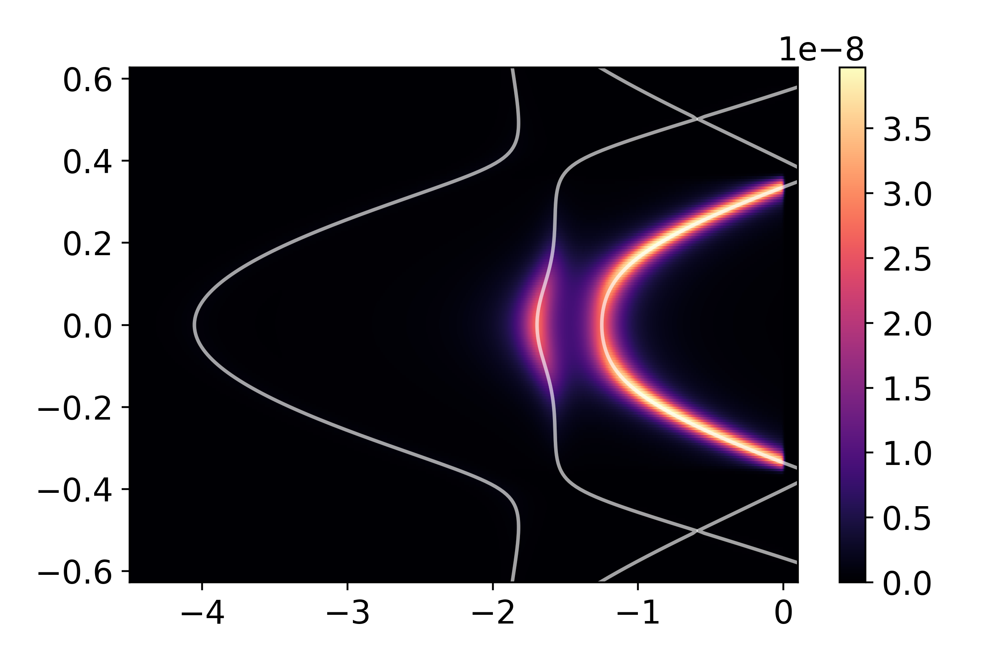

.. _tutorial:

.. toctree::
   :maxdepth: 2

Tutorial
********

SBQMI Workshop
==============

For use in the Student Seminar at SBQMI, we will use the following :download:`input <downloads/graphene_backend.py>` and :download:`run <downloads/graphene_front.py>` files. The exercises contained there are also available as an interactive *jupyter* :download:`notebook <downloads/QMI Student Seminar-Graphene.ipynb>`. 

Square Lattice
==============

The following tutorial is also available as an interactive *jupyter* notebook, available for download with the git repo_, in the examples folder. Alternatively, it can be :download:`downloaded here <downloads/introduction_to_chinook.ipynb>`.

.. _repo: https://github.com/rpday/chinook

Before beginning, it is also worth noting that in the interest of maintaining an organized workspace, it can be beneficial to define a separate input script independent of the working experimental script. Examples of an :download:`input file <downloads/input_square.py>` and :download:`experiment script <downloads/tutorial_square.py>` are available for this exercise. 

In this tutorial, we work through a calculation of simulated ARPES spectra from scratch. While several input format are accepted in chinook, here we use a Slater-Koster model for a square lattice.

Model Definition
================
The following modules will be needed for your work here.
::
	import numpy as np
	import chinook.build_lib as build_lib
	import chinook.operator_library as operators
	from chinook.ARPES_lib import experiment

We can begin by defining the lattice geometry, which we take here to be a square lattice. Throughout, feel free to try different parameters and geometries. Here, I've decided to make the in-plane dimensions smaller than the out of plane,
and since I'm taking a 2-atom basis, I've expanded my unit cell accordingly.
::
	a,c = 5.0,5.0
	avec = np.array([[np.sqrt(0.5)*a,np.sqrt(0.5)*a,0],
	[np.sqrt(0.5)*a,-np.sqrt(0.5)*a,0],
	[0,0,c]])

In *chinook*, functions which require many input arguments take dictionary-input, taking advantage of the readibility and tidyness of this datatype. Specifically, orbital basis, Hamiltonian, ARPES configurations are all defined using dictionaries. The first relevant object will be the momentum path, used for defining a high-symmetry path to first explore our tight-binding model.
::
	kpoints = np.array([[0.5,0.5,0.0],[0.0,0.0,0.0],[0.5,-0.5,0.0]])
	labels = np.array(['$M_x$','$\\Gamma$','$M_y$'])

	kdict = {'type':'F',
        'avec':avec,
        'pts':kpoints,
        'grain':200,
        'labels':labels}

	k_object = build_lib.gen_K(kdict)
	
Above, we get the first example of a dictionary-based set of arguments. We defined a k-path in fractional coordinate ('type':'F'). This requires the lattice vectors ('avec':avec) to define the path in units of inverse angstrom. The path itself is defined by 'points'. The 'grain' argument allows us to vary the number of steps between each segment of the k-path. Finally, we can pass an optional array of 'labels', for improving the readibility of figures plotted. 

We can now proceed to define our orbital basis. Since here I will use Antimony 5p states, we should include spin-orbit coupling, which is done with its own dictionary arguments. I define this on its own here, as I will want to re-use this dictionary for generating the Hamiltonian with spin-orbit coupling.
::
	spin = {'bool':True,  #include spin-degree of freedom: double the orbital basis
       'soc':True,    #include atomic spin-orbit coupling in the calculation of the Hamiltonian
       'lam':{0:0.5}} #spin-orbit coupling strength in eV, require a value for each unique species in our basis

	Sb1 = np.array([0.0,0.0,0.0])
	Sb2 = np.array([np.sqrt(0.5)*a,0,0])

	basis = {'atoms':[0,0], #two equivalent atoms in the basis, both labelled as species #0
        'Z':{0:51},     #We only have one atomic species, which is antimony #51 in the periodic table.
        'orbs':[['51x','51y','51z'],['51x','51y','51z']], #each atom includes a full 5p basis in this model, written in n-l-xx format
        'pos':[Sb1,Sb2], #positions of the atoms, in units of Angstrom
        'spin':spin} #spin arguments.

	basis_object = build_lib.gen_basis(basis)

We have defined the location of each atom in the orbital basis, and its full orbital content. Here we work with a full antimony 5p basis on each site. I have taken the second basis atom to sit in the centre of the ab plane, but you are free to modify this, as well as spin-orbit coupling strength, or even the atomic character.

At this point, we can define the Hamiltonian for our model. We will use a Slater Koster model for this, and we will assume nearest neighbour hoppings only. The options for the type of Hamiltonian are much more extensive, but the Slater Koster framework is very amenable to tuning parameters, so is a nice option for this tutorial. For p-p hopping, Slater Koster requires only 3 parameters: the on-site energy :math:`\epsilon_p` , :math:`V_{pp\sigma}` and :math:`V_{pp\pi}` .
::
	Ep = 0.7
	Vpps = 0.25
	Vppp = -1.0
	VSK = {'051':Ep,'005511S':Vpps,'005511P':Vppp}
	cutoff = 0.72*a

In the following, I'm going to use a slightly more advanced model, where rather than consider nearest neighbour hoppings only, I will also include next nearest neighbour hoppings. To do this, I specify a Slater-Koster dictionary for on-site and nearest neighbours, and a second dictionary for next-nearest neighbours. 
::
	V1 = {'051':Ep,'005511S':Vpps,'005511P':Vppp}
	V2 = {'005511S':Vpps/a,'005511P':Vppp/a}
	VSK = [V1,V2] 

These are distinguished by different cutoff-distances, with 0.8a sufficient for nearest neighbours, and 1.1a for next-nearest neighbours. 
::
	cutoff = [0.8*a,1.1*a]

	hamiltonian = {'type':'SK',     #Slater-Koster type Hamiltonian
              'V':VSK,          #dictionary (or list of dictionaries) of onsite and hopping potentials
               'avec':avec,     #lattice geometry
              'cutoff':cutoff,  #(cutoff or list of cutoffs) maximum length-scale for each hoppings specified by VSK
              'renorm':1.0,     #renormalize bandwidth of Hamiltonian 
               'offset':0.0,    #offset the Fermi level
              'tol':1e-4,       #minimum amplitude for matrix element to be included in model.
              'spin':spin}      #spin arguments, as defined above

Finally, we can bring all this together to define a tight-binding model object.
::
	TB = build_lib.gen_TB(basis_object,hamiltonian,k_object)

Model Characterization
======================

With the model so defined, we can now diagonalize, and perform some diagnostics on the tight-binding model. We start by plotting the bandstructure over the k path.
::
	TB.Kobj = k_object
	TB.solve_H()
	TB.plotting()

In the above model, we see the full bandstructure along high-symmetry directions for this model. Notably, the :math:`k_z` dispersion is zero, as the c-lattice constant is larger than our cutoff-lengthscale. You can try adjusting the cutoff distance, or the c-lattice constant to introduce these hopping terms.

There are several ways in which we can characterize our tight-binding model before proceeding to calculation of the photoemission intensity. Here, we consider the orbital projection or 'fat bands' plot, which illustrates the orbital weight of different different basis states. Before doing this, it's instructive to refer to the orbital basis ordering in our model. 
::
	TB.print_basis_summary()

	>>> Index | Atom | Label | Spin |     Position     
       ================================================
           0  |   0  |51x    |  -0.5| 0.000,0.000,0.000
           1  |   0  |51y    |  -0.5| 0.000,0.000,0.000
           2  |   0  |51z    |  -0.5| 0.000,0.000,0.000
           3  |   0  |51x    |  -0.5| 3.536,0.000,0.000
           4  |   0  |51y    |  -0.5| 3.536,0.000,0.000
           5  |   0  |51z    |  -0.5| 3.536,0.000,0.000
           6  |   0  |51x    |   0.5| 0.000,0.000,0.000
           7  |   0  |51y    |   0.5| 0.000,0.000,0.000
           8  |   0  |51z    |   0.5| 0.000,0.000,0.000
           9  |   0  |51x    |   0.5| 3.536,0.000,0.000
          10  |   0  |51y    |   0.5| 3.536,0.000,0.000
          11  |   0  |51z    |   0.5| 3.536,0.000,0.000

We want to plot the projection onto all :math:`p_x` , :math:`p_y` , and :math:`p_z` orbitals. We see that orbitals the set {0,3,6,9} are all :math:`p_x` , {1,4,7,10} are :math:`p_y` and {2,5,8,11} are :math:`p_x` . To visualize these projections then:
::
	px = operators.fatbs(proj=[0,3,6,9],TB=TB,Elims=(-5,5),degen=True) 
	py = operators.fatbs(proj=[1,4,7,10],TB=TB,Elims=(-5,5),degen=True)
	pz = operators.fatbs(proj=[2,5,8,11],TB=TB,Elims=(-5,5),degen=True)
	#The degen flag averages over degenerate states. All states are at least two-fold degenerate,
	#so this flag should certainly be on here.

.. image:: images/tutorial_fbs_x.png
	:width: 400

.. image:: images/tutorial_fbs_y.png
	:width: 400

.. image:: images/tutorial_fbs_z.png
	:width: 400

From this, we see that the bandwidth of the :math:`p_z` band is largest, over 2 eV larger than that of the in-plane :math:`p_{x,y}` states. Furthermore, plotting along the :math:`k_x` and :math:`k_y` directions, we see clearly the strong momentum dependence of the orbital character, which relaxes only near the avoided crossings where SOC mixes the orbital character.

In addition to orbital projections, we can also compute the expectation value of any Hermitian operator, and plot is value over each of the bands in a similar way. In this model, we have included spin-orbit coupling, and so we can plot :math:`\left< \vec{L}\cdot\vec{S}\right>` as an example.
::
	LdS_matrix = operators.LSmat(TB)
	LdS = operators.O_path(LdS_matrix,TB,degen=True)

While here I have made use of the built-in function operators.LSmat to generate my operator matrix, one can pass in principal any valid Hermitian operator defined over the dimension of the orbital basis: in this case we require a 12 x 12 Hermitian matrix.

ARPES Calculation
=================

While a number of other tools are available for model diagnostics, we'll proceed now to consideration of ARPES intensity simulation. Similar to the inputs defined above, we make use of Python dictionaries to organize the input 
arguments. Above, we saw that the Brillouin zone extends over a square of side-length 1.256 Å :math:`^{-1}` . We will begin by looking at the Fermi surface of our material.
::
	arpes = {'cube':{'X':[-0.628,0.628,300],'Y':[-0.628,0.628,300],'E':[-0.05,0.05,50],'kz':0.0}, #domain of interest
        'hv':100,                          #photon energy, in eV
         'T':10,                           #temperature, in K
        'pol':np.array([1,0,-1]),           #polarization vector
        'SE':['constant',0.02],            #self-energy, assume for now to be a constant 20 meV for simplicity
        'resolution':{'E':0.02,'k':0.02}}  #resolution

    arpes_experiment = experiment(TB,arpes) #initialize experiment object
	arpes_experiment.datacube() #execute calculation of matrix elements

Once the matrix elements have been calculated, the spectrum can be plot

The first thing we plot here is a constant energy contour, at the Fermi level
::
	I,Ig,ax = arpes_experiment.spectral(slice_select=('w',0.0))

The *spectral* function produces 2 output by default, corresponding to the raw, and resolution-broadened intensity maps. Generally speaking, the output is a 3-dimensional array of float, with the first two axes being momentum, and the last energy.

.. image:: images/tutorial_polp_ef.png
	:width: 400

In consideration of the bandstructure above, we expect 3 Fermi-surface sheets, so why do we only see two? This is an explicit consequence of the matrix-element effects. If we consider the orbital-projected plots above, the large spin-orbit coupling strongly mixes the orbital character over much of the Fermi-surface. However, :math:`p_z` character, which we are most strongly sensitive to with this polarization, is vanishing on the inner-most Fermi surface sheet. This readily explains its absence here. By however rotating polarization to be strictly in-plane, we can recover this sheet.
::
	arpes['pol'] = np.array([0,1,0])
	_ = arpes_experiment.spectral(arpes,slice_select=('w',0))

.. image:: images/tutorial_pols_ef.png
	:width: 400

An easy way to quickly navigate a calculation over a 2-dimensional region of momentum space is with the :meth:`matplotlib_plotter.interface()`. 
::
	import chinook.matplotlib_plotter
	interface = chinook.matplotlib_plotter.interface(arpes_experiment)

This will activate an interactive window, where constant :math:`k_x`, :math:`k_y`, and :math:`E` can be selected, and all slices can be explored.

We can explore the evolution of the orbital character and ARPES intensity over a broader range of momentum by computing the matrix elements over a wider energy window. Below, we do so for a fixed in-plane momentum
::
	arpes['cube'] = {'X':[-0.628,0.628,200],'Y':[0,0,1],'kz':0,'E':[-4.5,0.1,1000]}
	arpes['SE'] = ['constant',0.1]
	arpes['pol'] = np.array([1,0,-1])
	arpes_experiment = experiment(TB,arpes)
	arpes_experiment.datacube()
	_ = arpes_experiment.spectral(slice_select=('y',0),plot_bands=True)

.. image:: images/tutorial_polp_kx.png
	:width: 400

Another perspective on the connection to orbital character can be gained by again, changing the polarization:
::
	arpes['pol'] = np.array([0,1,0])
	_ = arpes_experiment.spectral(arpes,slice_select=('y',0),plot_bands=True)

While some bands are suppressed as a result of orbital and polarization symmetry, others still are suppressed due photoelectron interference. Our choice of a two-site unit cell is somewhat artificial, as there is no translational-symmetry breaking potential which prevents us from using a smaller one-atom unit cell. The folded bands in the reduced Brillouin zone of our excessively large unit cell can be described as anti-bonding states. To demonstrate this, we can perform a similar calculation over a wider domain of momentum, covering a full cut through the full Brillouin zone of the one-atom unit cell:
::
	arpes['cube'] = {'X':[-1.256,1.256,300],'Y':[0,0,1],'kz':0,'E':[-5,0.2,1000]}
	arpes_experiment = experiment(TB,arpes)
	arpes_experiment.datacube()
	I,Ig,ax = arpes_experiment.spectral(slice_select=('y',0),plot_bands=True)

In this tutorial, we have seen how to define and characterize a tight-binding model using chinook. In addition to this, we have performed a few calculations of the photoemission intensity associated with this model, and seen a few ways in which the photoemission intensity is affected by the nature of both our system of interest and the experimental geometry. Feel free to make changes to the model here and experiment with different parameters to get a better sense of how to use some of these tools. You're now ready to begin building your own models and simulating ARPES intensity for your material of choice. A template input file is provided :download:`here <downloads/template.py>`. 

